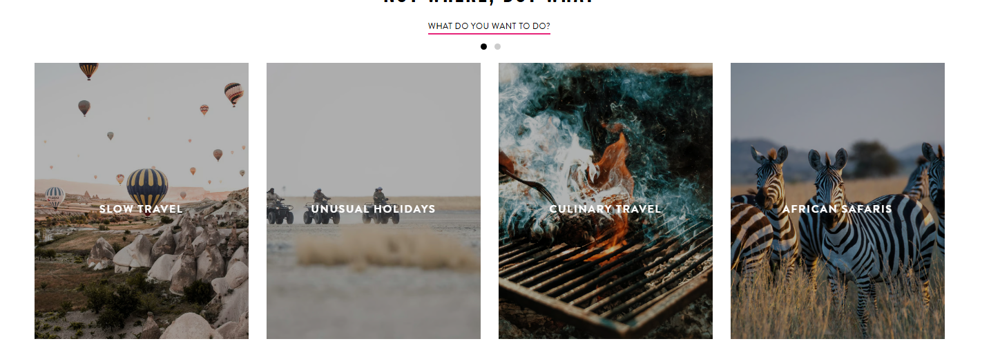

Hills Tour and Travels:
----------------------------

google Maps: https://maps.app.goo.gl/dRQPBFm6hTsZzNE2A
add: Phulbari,Darjeeling, West Bengal 734101, India
Google review summary: 4.9 (24 reviews)
Whatsapp: +91 99072 19843

1. Hero page:  (user facing)

I have 3 Images in C:\Users\FaradaysCage007\Desktop\2_PROJECTS\Hills_tour_and_travels\images\Hero_images_for_mobile

Texts:

Explore Darjeeling, Sikkim, (put all the Darjeelings and sikkims tourists spots in these animation with changing fonts)
with us.  (move this a bit up right below the 850+ travellers and review aligning to the left so the picture is clean)

Premium fleet • Local drivers • Curated tours • Door-to-door transfers (it should be right above explore packages and book now in a clean way)

sample and some thinking is in 

C:\Users\FaradaysCage007\Desktop\2_PROJECTS\Hills_tour_and_travels\design\curated\hero_design.md
                        

**Vehicles Available** (admin facing)

Innova 
Kiesta 
Desire
Wagnor 
Sumo

**Offerings**

1. These vehicles with the local Driver.
Hyper Local Sight seeing with experienced Drivers

2. Transport services, Pickup, Drop-off, customized Request.

2. Destination: 

Nepal - from darjeeling, siliguri, sikkim to Nepal

Bhutan - from darjeeling, siliguri, sikkim to Bhutan

Darjeeling - places of tourism given below

Sikkim - places of tourism given below

Kurseong - places of tourism given below

Mirik - places of tourism given below

Kalimpong - places of tourism given below

Lamahatta - places of tourism given below

**Packages** (this should be mapped with **Experiences**)

Darjeeling

 1. Tiger hill: Sunrise over Kanchenjunga, The closes sunrise you will ever see.
 2. Batasia Loop: The himalayan Toy Train lopping thorough Batasia.
 3. Dali Monastery: Peaceful Spiritual Tibetan Monastery Experience, Arts and Crafts.
 4. Darjeeling Himalayan Railway: The oldest raiway station "Toy Train"
 5. Chowrasta (The Mall): The local vibe and hangout place where most of the people you see.
 6. Padmaja Naidu Himalayan Zoological Park & HMI: Red panda, snow leopard, Himalayan Mountaineering Institute globally recognized.
 7. Japanese Peace Pagoda: Built under the guidance of a Japanese monk years ago
 8. Happy Valley Tea Estate: 1854, it's the most accessible tea garden from the main town.
 9. Rock Garden & Ganga Maya Park:A multi-tiered, terraced garden carved directly out of a rocky cliffside, centered around the Chunnu Summer Falls.
 10. Darjeeling Ropeway:A cable car ride that glides directly over the lush Rangeet Valley tea estates. Birds eye view of the place.

Sikkim

 1. TMG Marg (Gangtok): The central hangout hub, a clean, vehicle-free street packed with cafes, shops, and the best local evening vibe.
 2. Tsomgo (Changu) Lake: A stunning high-altitude glacial lake at 12,400 feet that changes color with the seasons.
 3. Gurudongmar Lake: A rugged, sacred high-altitude lake at 17,800 feet surrounded by breathtaking, raw mountain terrain.
 4. Nathu La Pass: The historic Indo-China border crossing high in the snow-capped Himalayas.
 
 Kurseong

 1. Eagle's Crag: An observation tower offering panoramic views of the plains below and spectacular evening sunsets.
 2. Dowhill Road: A winding, misty stretch famous for its dark, atmospheric pine forests and legendary haunted reputation.
 3. Makaibari Tea Estate: One of the oldest tea gardens in the world, perfect for quick factory tours and tasting organic tea.
 
Mirik

 1. Sumendu Lake: The calm centerpiece of the town featuring an arching footbridge, pine tree trails, and casual boating.
 2. Tingling View Point: Sweeping, unobstructed views of the sprawling tea gardens covering the rolling hills before you enter the town.

 3. Bokar Monastery: A peaceful hilltop meditation center that looks directly down over Mirik Lake.

Kalimpong

 1. Deolo Hill: The highest point in town, a massive landscaped park perfect for picnics, valley views, and paragliding.
 2. Durpin Monastery: A quiet Tibetan monastery housing rare manuscripts and offering huge vantage points over the Teesta valley.

 3. Pine View Nursery: A massive, globally recognized greenhouse collection of exotic cacti and rare orchids.

 
 Lamahatta

 1. Lamahatta Eco Park: Manicured gardens and vibrant prayer flags that lead right into a quiet, misty pine forest walking trail.
 2. Peshok Tea Garden: Endless rolling green carpets of tea that offer some of the best roadside photography stops on the way down the hill.

 Tinchuley

 1. Tinchuley View Point: A quiet, offbeat village spot famous for dramatic, uncrowded sunrise views over the Kanchenjunga range.
 
 2. Gumbadara View Point: A rocky hilltop offering a massive, wide-angle view of the Teesta River winding through the valley.tography stops on the way down the hill.

 Teesta

 1. Lovers Meet View Point: The ultimate bird's-eye view from the highway looking down at the green Rangeet and dark Teesta rivers crashing together.
 
 2. Triveni Camping & Sangam: The actual river convergence point down on the white sand, perfect for riverside bonfires and overnight stays.
 
 3. Teesta River Rafting: White-water rafting routes that take you right through the deep, rocky gorges of the river valley.

**Experiences** (this should be mapped with **Packages**)

The sample is in 

responsive design.

Family Getaways 
Romantic Escapes
Solo Explorers
Friend Squads
Corporate Offsites
Luxury - hotel bookings to everything with 1 day, 2 days - 10-15 days customized.

separate your utility services into a "Quick Transit & Support" strip as a slim, high-contrast bar just below the hero image.

**Ideas**

What if we go where tourists are instantly? like an uber for sightseeing.

Big swipable cards for siliguri, gangtok, bhutan, nepal, Darjeeling, Kurseong, Lamahatta, Takdah, Sittong, Mirik, Kalimpong, Lava, Lolegaon,reshi khola, Darjeeling Zoo and so on and once you click the card it will show you to and from like an uber and make user easy when you type, S it should either siliguri, sittong, sikkim, sittong etc very low friction.

Book now should be very easy, user should be able to book within 30 seconds and make a payment and confirm that with the timing.

It would be a good idea to search the booking design through uber, ola, rapido, where user is already familiar with the booking process with less friction.

very important: It should be in all the languages toggle mainly English, Hindi, Bengali, chinese, thai etc. mainly focusing on the maximum number of tourist coming from other countries.

Well, if there is a solo and want to share the cab or something they can do it too with the same packages. 
need to see the viability just like shared uberpool or something like that.

**Parteners** should be at the bottom.

Hotels booking: feature hotels that has no cars or a driver or a minimum drivers to book a local sightseeing from hillstourandtravel.com

**Operation**

Admin : able to change, add, refine the packages, drivers, vehicles, hotels (parteners) directly through admin console conencted to the Databse management systems.
Change, manage, refund, add, booking systems through the admin console.

