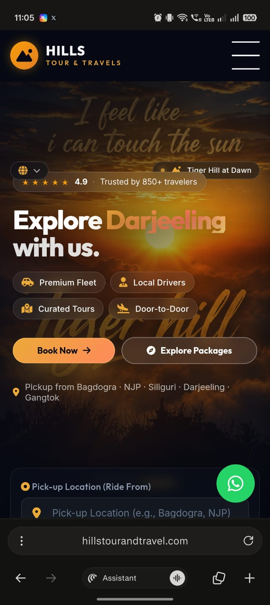

The words in the hero page are still jumbled up. screenshot is in 

1. put the toggle bar right between the hills tour and travels logo and navbar, Navbar is too big, get the amazing navbar premium one replace hamburger with another one make it premium

Pickup location ride from is peeking from below it should be on another page
The one that is coming up sunrise on kunchunjunga, tiger hill at dawn remove that 
trust one, trusted by 850 travellers should be up right below the hills tour and travels 
Book now should be right where the whatsapp is and explore package to the left I want this clean as possible.

Packages slider.

Get the code from https://codepen.io/MDJAmin/pen/GgpdKPy

I have also put 